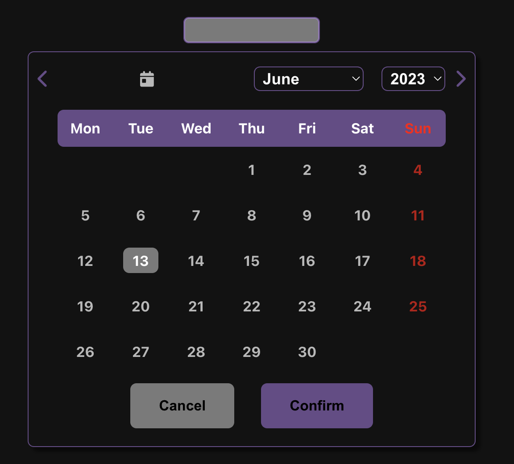

# Date Picker Component for React

A flexible and customizable date picker component for React applications.




# Installation

Install the package using npm:

```
npm install toonba-react-date-picker-library
```

# Usage

Import the DatePicker component and built in configuration and use it in your React application:

```js
import React from 'react'
import { config, DatePicker } from 'toonba-react-date-picker-library'

function App() {
  return (
    <div>
      <h1>Select a Date</h1>
      <DatePicker minDate={config.minDate} maxDate={config.maxDate} customStyle={config.lightTheme} getData={yourCustomeFunction} inputReset={yourReset} />
    </div>
  )
}
```

# Props

The DatePicker component accepts the following props:

<ul>
  <li>minDate: Minimum selectable date (must be a Date object).</li>
  <li>maxDate: Maximum selectable date(must be a Date object).</li>
  <li>customeStyle: object containing custome Style</li>
  <li>getData : is the function that allow you to retrieve the date selected it will be a Date object</li>
  <li>inputReset : string that will allow you to reset the datePicker if you pass '' </li>
</ul>

In the config file you will find minDate en maxDate + 2 custome Style (dark and light mode), you can create your own custome style it must look like the one in config

```js
const config = {
  minDate: new Date('01.01.2020'),
  maxDate: new Date('12.31.2025'),
  lightTheme: {
    borderRadius: '7px', // handle border-radius for focused input, calendar Wrapper, select input, current day
    calendarWidth: '500px', // handle width of calandarWrapper
    backgroundColor: 'white', // handle background color for callandar Wrapper, select and input
    primaryColor: 'rgba(145, 175, 37, 0.3)',
    primaryColorHover: 'rgba(145, 175, 37, 0.6)',
    secondaryColor: 'rgba(192, 192, 192, 0.3)',
    secondaryColorHover: 'rgba(192, 192, 192, 0.7)',
    textColor: 'black',
    inputBackground: 'white'
    inputWidth: '200px'
  },
  darkTheme: {
    borderRadius: '7px',
    calendarWidth: '500px',
    backgroundColor: ' #121212',
    primaryColor: 'rgba(187, 134, 252, 0.5)',
    primaryColorHover: 'rgba(187, 134, 252, 0.9)',
    secondaryColor: 'rgba(192, 192, 192, 0.6)',
    secondaryColorHover: 'rgba(255, 255, 255, 0.9)',
    textColor: 'white',
    inputBackground: 'rgba(192, 192, 192, 0.6)',
    inputWidth: '200px'
  }
}
```

Contributing
Contributions, bug reports, and feature requests are welcome! Feel free to open an issue or submit a pull request on the GitHub repository.

License
This project is licensed under the MIT License. See the LICENSE file for details.
